# Computacao_Evolutiva

## Possíveis projetos:
- Melhorar Artigo OD: 
	* Modelagem, pois tenho entradas e as saídas, e quero um modelo que generaliza esta relação
    * Aplicar Algoritmos Evolucionários para descobrir melhores arquiteturas de redes neurais

- Melhores funções para calibração de sensores: 
	* Modelagem, pois quero uma função que retorne valores mais precisos. 
	* Tenho a tensão de entrada, mas não a relação Tensão (Volt) X Parâmetro, para fazer a comparação. 
	* Preciso gerar uma base de dados anotada para este propósito ou achar na internet.
	* Problema inicialmente a ser avaliado com o sensor de pH (ph4502c)

## Dúvidas:

* como o algoritmo evolucionário se relaciona com problemas de modelagem? Ao meu ver
ele é diretamente ligado às entradas, ou seja, os inputs utilizados num dado modelo
    * Resposta: Todo problema de modelagem pode ser convertido num problema de otimização, como por exemplo o de descobrir uma boa arquitetura de redes neurais, com o cromossomo sendo a rede neural junto de seus hiperparâmetros

# 

## Aula 1 - Péricles

Entrada -> Modelo -> Saída

Otimização:	Temos o modelo e saídas, queremos achar uma entrada adequada
Modelagem:	Temos a entrada e saída, queremos achar um modelo adequado
Simulação:	Temos a entrada e o modelo, queremos achar uma saída adequada

||Entrada|Modelo|Saída|
|-|-|-|-|
|Otimização|❌|✔| ✔|
|Modelagem|✔|❌|✔|
|Simulação|✔|✔|❌|

espaço de busca: 	conjunto de todos os objetos de interesse, incluindo a solução do problema
função objetivo:	forma de quantificar o valor de um objeto de interesse

gene: 	é o vetor de caracteristica do indivíduo
alelo:	posições do vetor de característica do indivíduo

## Aula 2 - Péricles

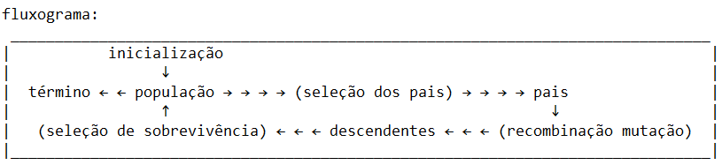

cruzamento:	envolve a recombinação do gene de 2 indivíduos pais

mutação: 	envolve a modificação aleatoria de alelos de um indivíduo

## Aula 3 - Péricles

**Exploration**: (horizontal) utilizando todo o espaço de busca.

**Explotation**: (vertical) refinar o problema, utilizando soluções promissores, identificadas na exploração.

### Representação Binária: Lista de 0s e 1s

* Mutação: 
    - Bitwise: Dada uma probabilidade, cada alelo do cromossomo pode mudar seu valor binário
    
        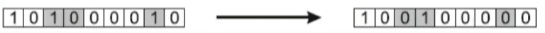

* Cruzamento (recombinação):
    - Crossover de um ponto (OnePointCrossover): Dado um threshold (porção) selecionado aleatoriamente, escolhem-se 2 individuos e suas porções são trocadas com base neste threshold, gerando 2 novos indivíduos

        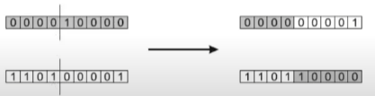

    - Crossover de dois pontos (TwoPointCrossover): Dado dois thresholds (porções) selecionados aleatoriamentes, escolhem-se 2 individuos e a porção entre os thresholds são trocadas entre eles, gerando 2 novos indivíduos.

        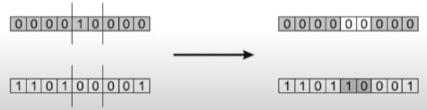

    - Crossover Uniforme: Cuidado para não confundir com o bitwise mutation (apenas 1 individuo), esta operação utiliza 2 individuos. Baseado num threshold, e com 2 individuos aleatoriamente selecionados, calcula-se um número aleatório alelo a alelo. Se o número for maior que o threshold, então o respectivo alelo é trocado entre os 2 individuos.     

        

### Representação Inteira: Lista numeros inteiros

* Mutação:
    - Random Resetting: Semelhante a mutação bitwise, baseado num threshold, calcula-se um número aletório para cada alelo, se o número for maior que o threshold, então o alelo recebe um inteiro aleatório num dado range (no exemplo abaixo o range é de 0 a 5).

        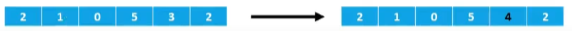

    - Creep Mutation: Semelhante a mutação random reseting, baseado num threshold, calcula-se um número aletório para cada alelo, se o número for maior que o threshold, então o alelo recebe um incremento ou decremento. A operação de incremento ou decremento é definida pelo especialista, bem como o valor a ser operado.

        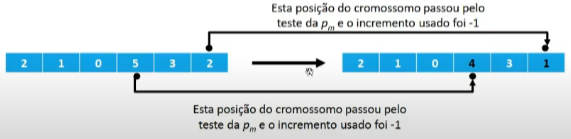

* Cruzamento (recombinação): Os cruzamentos para representação binária também se aplicam a representação inteira.

### Representação Real (ponto-flutuante): Lista numeros float
    
* Mutação: Creep Mutation e Random Resetting também se aplicam. 
    - Mutação Não-Uniforme: Semelhante ao Creep Mutation. Opera-se o incremento/decremento com número float baseado numa distribuição gaussiana de média zero e desvio padrão escolhido pelo especialista. 

        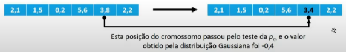

    - Random Resetting agora gera de números float

        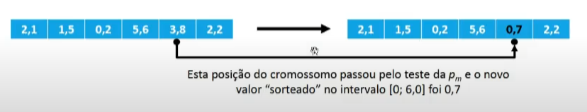

* Cruzamento (recombinação): As mais usadas são a Discreta e Aritimética. Em ambas, as recombinações OnePointCrossover, TwoPointCrossover, etc se aplicam a elas. No TwoPointCrossover + Discreta, por exemplo, a porção selecionada para crossover, é apenas trocada, como ocorre na representação binária, porém no TwoPointCrossover + Aritimética, pode-se realizar operações nesta porção (soma e subtração por exemplo) trazendo novos individuos ainda mais diferentes. Por exemplo, no exemplo abaixo, calculou-se um OnePointCrossover e no threshold selecionado operou-se a média alelo a alelo para o novo individuo

    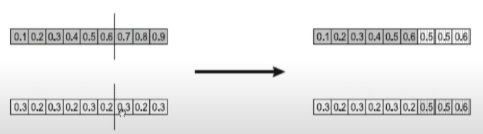

### Representação de permutação: 

É ligada a representação inteira, porém neste caso não é permitida a repetição dos valores. Operações como Creep Mutation e Random Resetting não são ideais, pois podem gerar elementos repetidos

* mutação:
    - swap mutation: baseado num threshold, troca-se a posição de dois alelos aleatoriamente.

        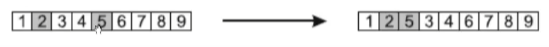

    - scramble mutation: o cromossomo inteiro ou parte dele é escolhido aleatoriamente pra ser embaralhado. Outra variação é alterar a ordem.       

        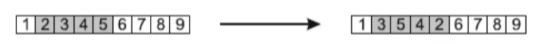

* Cruzamento (recombinação): 
    - Parttially Mapped Crossover (PMX): Ver a explicação no aula 4 de péricles.

        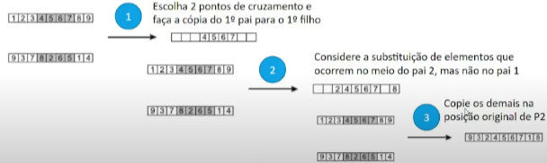

## Aula 4 - Péricles

> μ (mi) - população inicial

> λ (lambda) - descendentes gerados 

### Gerenciamento da população

* Controle por Geração: 
    * a cada geração novos individuos são gerados
    * com o tempo os pais são substituidos pelos descendentes
    * ponto forte: processo mais rápido, menor chance de underfit
    * ponto fraco: pode ocorrer um overfit

* Estado estacionário (steady-state):
    - a cada geração novos individuos são gerados
    - poucos individuos são substituidos por geração (geralmente 1 por geração)
    - ponto forte: processo mais lento, menor chance de overfit
    - ponto fraco: pode ocorrer underfit na execução depoucas gerações

Em algoritmos básicos o μ é igual ao λ, ou seja, toda a população é substituida.

No modelo estacionário, o λ = 1, ou seja, apenas 1 individuo é substituido por geração.

### Seleção dos pais

- **proporcional ao fitness (fitness proportional selection - FPS)**: melhor individuo tem mais chances de ser selecionado. Porém o lado negativo é o de a convergência para ótimos locais. (convergencia prematura)
- **por posição (ranking)**: a população é ordenada com base no ranking, e com base numa função calcula-se a probabilidade deles serem selecionados, com os individuos mais a frente da fila com maior probabilidade.
- **por roleta**: como uma roleta de cassino, onde individuos com maior fitness possuem mais "fatias" da roleta, aumentando sua probabilidade de serem selecionados.
- **por torneio**: dado um valor K, pegamos K individuos e selecionados para a próxima geração o com melhor fitness, repetimos isto até a quantidade de membros selecionados for maior ou igual ao λ (nº descendentes gerados). 
- **uniforme**: todos tem a mesma probabilidade de serem selecionados
- **por grupos para grandes populações**: ordena-se a população por fitness e dada uma probabilidade P de cada grupo seleciona-se uma quantidade X de cada grupo.

### Seleção dos sobreviventes

A seleção dos pais, que serviu para selecionar os individuos que se reproduziriam, fez o tamanho da população ficar maior do que μ (tamanho máximo permitido da população). Desta forma a seleção dos sobreviventes serve para selecionar, dentre os pais e seus descendentes, quais individuos participarão da próxima geração.

- **Mecanismo baseado na idade (n: º de gerações)**: usa-se a idade ao invés do fitness, tornando indivíduos novos os preferidos. (pode substituir todos os pais)

- **Mecanismos baseados no fitness**: mais utilizada, seleciona-se com base no fitness. Abordagem elitista.

## Aula 5 - Péricles 

Otimização do GA Sphere e Awkley