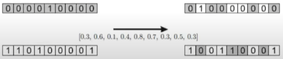

# Computacao_Evolutiva

## Aula 3 - Péricles

### Representação Binária: Lista de 0s e 1s

* Mutação: 
    - Bitwise: Dada uma probabilidade, cada alelo do cromossomo pode mudar seu valor binário
    
* Cruzamento (recombinação):
    - Crossover de um ponto (OnePointCrossover): Dado um threshold (porção) selecionado aleatoriamente, escolhem-se 2 individuos e suas porções são trocadas com base neste threshold, gerando 2 novos indivíduos
    
    - Crossover de dois pontos (TwoPointCrossover): Dado dois thresholds (porções) selecionados aleatoriamentes, escolhem-se 2 individuos e a porção entre os thresholds são trocadas entre eles, gerando 2 novos indivíduos.
    
    - Crossover Uniforme: Cuidado para não confundir com o bitwise mutation (apenas 1 individuo), esta operação utiliza 2 individuos. Baseado num threshold, e com 2 individuos aleatoriamente selecionados, calcula-se um número aleatório alelo a alelo. Se o número for maior que o threshold, então o respectivo alelo é trocado entre os 2 individuos.     
    

### Representação Inteira: Lista numeros inteiros

* Mutação:
    - Random Resetting: Semelhante a mutação bitwise, baseado num threshold, calcula-se um número aletório para cada alelo, se o número for maior que o threshold, então o alelo recebe um inteiro aleatório num dado range (no exemplo abaixo o range é de 0 a 5).
    
    - Creep Mutation: Semelhante a mutação random reseting, baseado num threshold, calcula-se um número aletório para cada alelo, se o número for maior que o threshold, então o alelo recebe um incremento ou decremento. A operação de incremento ou decremento é definida pelo especialista, bem como o valor a ser operado.
    

* Cruzamento (recombinação): Os cruzamentos para representação binária também se aplicam a representação inteira.

### Representação Real (ponto-flutuante): Lista numeros float
    
* Mutação: Creep Mutation e Random Resetting também se aplicam. 
    - Mutação Não-Uniforme: Semelhante ao Creep Mutation. Opera-se o incremento/decremento com número float baseado numa distribuição gaussiana de média zero e desvio padrão escolhido pelo especialista. 
    
    - Random Resetting agora gera de números float
    

* Cruzamento (recombinação): As mais usadas são a Discreta e Aritimética. Em ambas, as recombinações OnePointCrossover, TwoPointCrossover, etc se aplicam a elas. No TwoPointCrossover + Discreta, por exemplo, a porção selecionada para crossover, é apenas trocada, como ocorre na representação binária, porém no TwoPointCrossover + Aritimética, pode-se realizar operações nesta porção (soma e subtração por exemplo) trazendo novos individuos ainda mais diferentes. Por exemplo, no exemplo abaixo, calculou-se um OnePointCrossover e no threshold selecionado operou-se a média alelo a alelo para o novo individuo

### Representação de permutação: 

É ligada a representação inteira, porém neste caso não é permitida a repetição dos valores. Operações como Creep Mutation e Random Resetting não são ideais, pois podem gerar elementos repetidos

* mutação:
    - swap mutation: baseado num threshold, troca-se a posição de dois alelos aleatoriamente.
    
    - scramble mutation: o cromossomo inteiro ou parte dele é escolhido aleatoriamente pra ser embaralhado. Outra variação é alterar a ordem.       
    

* Cruzamento (recombinação): 
    - Parttially Mapped Crossover (PMX): Ver a explicação no aula 4 de péricles.
    

## Aula 4 - Péricles

### Gerenciamento da população

